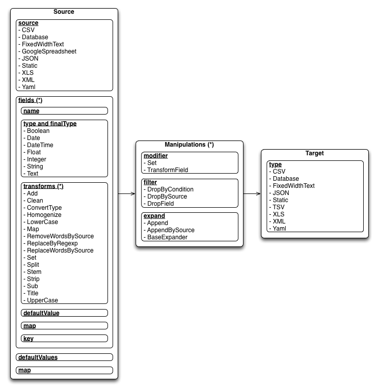

# Change Log

### Version 0.1.8
- .0: Minor, but usefull changes

   * DatabaseTarget has a new attribute which is allowing to continue the write/update process when error happens.
   
            target:
               type: Database
               url: sqlite:///database.db
               table: t_table
               createTable: true
               continueOnError: true
   
   * Migration on big dataset running time optimization.
   * Execute function on DatabaseTarget. 
   
      You could use to load data into special or multiple table in one time or trigger changes (deleted, changed, ...) on records based on migration differences.
     
      In 0.1.7 inactivate deleted records was sluggish, currently it's quite easy.
      
            metl-differences -d delete.yml migration/current.pickle migration/prev.pickle

      where delete.yml is the following:

            target:
               type: Database
               url: sqlite:///database.db
               fn: mgmt.inactivateRecords

      mgmt.py is contains:

            def inactivateRecords( connection, delete_buffer, other_buffer ):
                   
               connection.execute( 
                  """
                  UPDATE
                      t_table
                  SET
                      active = FALSE
                  WHERE
                      id IN ( %s )
                  """ % ( ', '.join( [ b['key'] for b in delete_buffer ] ) ) 
               )

- .1: Added logger attribute to Source/Manipulation/Target elements to define specific logger method.
- .2: AppendAllExpand get skipIfFails attribute
- .3: Neo4j Target added
- .4: mETL-transfer command added to migrate and copy whole databases
- .5: Minor fix on mETL transfer
- .6: Fixed a bug in mETL-transfer when using on big datasets sometimes lost source connection.

### Version 0.1.7
- .0: Major changes and running time reduction.

   * Changed PostgreSQL target to load data more efficient (12x speed boost) by creating a workaround for psycopg2 and SQLAlchemy's slow behaviour. 
   * JSON file loading now replaced to standard json package (from demjson) because faster with big (>100MB) files.
   * BigInteger type is added to handle 8bit length numbers.
   * Pickle type is added to handle serialized BLOB objects.

    
   **IMPORTANT**: The alternate PostgreSQL target will work with only basic field types and lower case column names.
   
- .1: Added GoogleSpreadsheetTarget to write and update Spreadsheet files.
- .2: Added AppendAll expander to append files content by walking a folder.

### Version 0.1.6
- .0: Changed XML converter to <a href="https://github.com/bfaludi/xmlsquash">xmlsquash</a> package. 

   **IMPORTANT**: It has a new XML mapping technique, all XML source map must be updated!
   
   * For element's value: path/for/xml/element/**text**
   * For element's attribute: path/for/xml/element/attributename

- .0: Fixed a bug in XML sources when multiple list element founded at sub-sub-sub level.
- .0: Fixed a bug with htaccess file opening in CSV, TSV, Yaml, JSON sources.
- .1: Fixed a bug where map ending was *
- .1: Added SetWithMap modifier and Complex type
- .2: Fixed a bug in List expander when field's value was empty.
- .2: Split transform could split a list items too.
- .2: Clean transform removes new lines. 
- .3: Added Order modifier.
- .4: Added basic aggregator functions.
- .5: Added dinamicSheetField attribute to XLS target to group your data in different sheets.
- .6: Added KeepByCondition filter.
- .7: JSON, Yaml source rootIterator and XML source itemName attributes are working like fieldMaps.
- .8: Absolute FieldMap (starts with `/` mark) usage for JSON, XML, YAML files.
- .9: Database source has a resource attribute to handle sql statements via file.
- .10: Database source has a params attribute to add parameters to statements.
- .11: Fields has a new limit attribute for database targets. Easy to add new database types if necessary.
- .12: Boolean conversion is working for String correctly.
- .13: Added JoinByKey modifier to easily join two sources and fill out some fields.
- .14: Added `metl-generate` command to generate automaticaly Yaml configuration files.

### Version 0.1.5
- .0: htaccess file opening support.
- .1: List type JSON support for database target and source.
- .1: ListExpander with map ability.

### Version 0.1.4
- .0: First public release.
- .1: Remove elementtree and cElementTree dependencies.
- .2: TARR dependency link added, PyXML dependency removed.
- .3: JSON target get a compact format parameter to create pretty printed files.
- .4: Update TARR dependency.
- .5: Add missing dependency: python-dateutil
- .6: Fixed xml test case after 2.7.2 python version.
- .7: Fixed List type converter for string or unicode data. It will not split the string!
- .8: Fixed JSON source when no root iterator given and the resource file is contains only one dictionary.
- .9: Added a new operator `!` to convert dictionart into list in mapping process.
- .10: Fixed a bug in Windows when want to open a resource with absolute path.
- .11: Added ListExpander to expand list information into single fields.
- .12: XML source open via http and https protocols.

# First steps

## The basics
mETL is an ETL device which has been especially designed to load elective data necessary for CEu. Obviously, the programme can be used in a more general way, it can be used to load practically any kind of data. The programme was designed with Python, taking into maximum consideration the optimal memory usage after having assessed the Brewery device’s capabilities. 

## Capabilities
The actual version supports the most widespread file formats with data migration and data migration packages. These include:

**Source- types**:

- CSV, TSV, XLS, Google SpreadSheet, Fixed width file
- PostgreSQL, MySQL, Oracle, SQLite, Microsoft SQL Server
- JSON, XML, YAML

**Target- types:**

- CSV, TSV, XLS - with file continuation as well
- Fixed width file
- •   PostgreSQL, MySQL, Oracle, SQLite, Microsoft SQL Server - with the purpose of modification as well
- JSON, XML, YAML

During the develpoment of the programme we tried to provide the whole course of processing with the most widespread transformation steps, programme structures and mutation steps. In light of this, the programme by default possesses the following transformations: 

- **Add**: Adds an arbitrary number to a value.
- **Clean**: Removes the different types of punctuation marks. (dots, commas, etc.)
- **ConvertType**: Modifies the type of the field to another type.
- **Homogenize**: Converts the accentuated letters to unaccentuated ones. (NFKD format)
- **LowerCase**: Converts to lower case.
- **Map**: Changes the value of a field to anothe value.
- **RemoveWordsBySource**: Using another source, it removes certain words.
- **ReplaceByRegexp**: Makes a change (replaces) by a regular expression.
- **ReplaceWordsBySource**: Replaces words using another source.
- **Set**: Sets a certain value.
- **Split**: Separates words by spaces and leaves a given interval.
- **Stem**: Brings words to a stem. (root)
- **Strip**: Removes the unnecessary spaces and/or other characters from the beginning and ending of the value.
- **Sub**: Subtracts a given number from a given value.
- **Title**: Capitalizes the first letter of every word.
- **UpperCase**: Converts to upper case.

Four groups are differentiated in case of manipulations:

1. **Modifier**

   Modifiers are those objects that are given a whole line (record) and revert with a whole line. However, during their processes they make changes to values with the usage of the related values of different fields. 
   
   - **JoinByKey**: Merge and join two different record.
   - **Order**: Orders lines according to the given conditions.
   - **Set**: Sets a value with the use of fix value scheme, function or another source.
   - **SetWithMap**: Sets a value in case of a complicated type with a given map.
   - **TransformField**: During manipulation, regular field transformation can be achieved with this command .
   
2. **Filter**

   Their function is primarily filtering. It is used when we would like to evaluate or get rid of incomlete or faulty records as a result of an earlier tranformation.

   - **DropByCondition**: The fate of the record depends on a condition.
   - **DropBySource**: The fate is decided by whether or not the record is in another file.
   - **DropField**: Does not decrease the number of records but field can be deleted with it.
   - **KeepByCondition**: The fate of the record depends on a condition.

3. **Expand**

   It is used for enlargement if we would like to add more values to the present given source.

   - **Append**: Pasting a new source file identical to the used one after the actual one being used.
   - **AppendBySource**: A new file source may be pasted after the original one.
   - **Field**: Collects coloumns as parameters and puts them into another coloumn with the coloumns’ values.
   - **BaseExpander**: Class used for enlargement, primarily used when we would like to multiply a record.
   - **ListExpander**: Splits list-type elements and puts them into separate lines.
   - **Melt**: Fixes given coloumns and shows the rest of the coloumns as key-value pairs.

4. **Aggregator**

   Aggregators are used to connect and arrange data.
   
   - **Avg**: Used to determine the mean average.
   - **Count**: Used to calculate figures.
   - **Sum**: Used to determine sums.

### Komponent figure

## Installation
As a traditional Python package, installation can the most easily be carried out with the help of the following command int he mELT directory:  
`python setup.py install` or `easy_install mETL`
Then the package can be tested with the following command:  
`python setup.py test`
The package has the following dependancies: python-dateutil, xlrd, gdata, demjson, pyyaml, sqlalchemy, xlwt, tarr, nltk, xlutils, xmlsquash

### Mac OSX
Before installation, one needs to have the following packages installed:

- XCode
- Code ’Command Line Tools’
- [Macports](https://distfiles.macports.org/MacPorts/MacPorts-2.1.3-10.8-MountainLion.pkg)

Afterwards all packages are installed properly.

### Linux
Before installation, one needs to check that they have `python-setuptools` and in case of its absence it need to be insalled with the help of `apt-get install`.

## Running of the programme
The programme is a collection of console scripts which can be built into all systems and can even be timed with the help of cron scripts.

**The programme is made up of the following scipts:**

1. `metl [options] CONFIG.YML`

   A complete process can be started with the help of it ont he basis of the YAML file as a parameter. The processes in the configuration should all be described by the configuraion file including the exact route of input and outout files.
   
   - `-t`: During running, it prepares a migration file from the state of the present data.
   - `-m`: Conveyance of previous migration file that was part of the previously run version.
   - `-p`: Conveyance of a folder, which is added to the PATH variable in order that the link in the YAML configuration could be run on an outside python file.
   - `-d`: ’debug’ mode, writes everything out as stdout.
   - `-l`: Determines the number of elements for processing. An excellent option to test large files within small records until everything works as we would like to.
   - `-o`: Determines from which element should the processing start.
   - `-s`: If the configuration does not contain the route of the resource, it could be given here as well.

   Migarion and `–p` will be dealt with more in depth later.

2. `metl-walk [options] BASECONFIG.YML FOLDER`
   
   Feladata a paraméterül kapott YAML fájl alkalmazása, minden paraméterül kapott mappában szereplő állományra nézve. A konfigurációnak ebben az esetben nem kell az input fájlok elérhetőségét tartalmazni, a script automatikusan elvégzi ezek behelyettesítését.
   
   - `-m`: Walk the files with multiple process. (use only for database target)
   - `-p`: Conveyance of a folder, which is added to the PATH variable in order that the link in the YAML configuration could be run on an outside python file.
   - `-d`: ’debug’ mode, writes everything out as stdout.
   - `-l`: Determines the number of elements for processing. An excellent option to test large files within small records until everything works as we would like to.
   - `-o`: Determines from which element should the processing start.
   
   Migarion and `–p` will be dealt with more in depth later.
   
3. `metl-transform [options] CONFIG.YML FIELD VALUE`
   
   Feladata a YAML fájlban szereplő egyik mező transzformációs lépéseinek tesztelése. Paraméterül várja a mező megnevezését, és azt az értéket, amelyen a tesztelést végeznénk. A script ki fogja írni lépésről-lépésre a mező értékének alakulását.

   - `-p`: Conveyance of a folder, which is added to the PATH variable in order that the link in the YAML configuration could be run on an outside python file.
   - `-d`: ’debug’ mode, writes everything out as stdout.
   
   Migarion and `–p` will be dealt with more in depth later.
   
4. `metl-aggregate [options] CONFIG.YML FIELD`

   Feladata kigyűjteni a paraméterül átadott mező összes lehetséges értékét. Ezen értékek alapján utána már könnyen készíthető Map a rekordokhoz.

   - `-p`: Conveyance of a folder, which is added to the PATH variable in order that the link in the YAML configuration could be run on an outside python file.
   - `-d`: ’debug’ mode, writes everything out as stdout.
   - `-l`: Determines the number of elements for processing. An excellent option to test large files within small records until everything works as we would like to.
   - `-o`: Determines from which element should the processing start.
   - `-s`: If the configuration does not contain the route of the resource, it could be given here as well.
   
   A `-p` kapcsolóról később lesz szó részletesebben.
   
5. `metl-differences [options] CURRENT_MIGRATION LAST_MIGRATION`

   Feladata két különböző migráció összehasonlítása. Első paramétere a friss, és második paramétere a korábbi migráció. A script megmondja, mennyi elem került bele az újba, mennyi elem módosult, mennyi elem maradt változatlan, illetve került törlésre.
   
   - `-n`: Konfigurációs állomány az új elemek kulcsainak kiírására.
   - `-m`: Konfigurációs állomány a módosult elemek kulcsainak kiírására.
   - `-u`: Konfigurációs állomány a módosulatlan elemek kulcsainak kiírására.
   - `-d`: Konfigurációs állomány a törölt elemek kulcsainak kiírására.

6. `metl-generate [options] SOURCE_TYPE CONFIG_FILE`

   Egy választott forrás állományból készít Yaml kongirációs állományt. Ahhoz hogy a konfiguráció elkészülhessen meg kell adni a forrás alapvető inicializálási és forrás paramétereit.

   Szükséges paraméterek listáját a következőképpen le lehet kérni: `metl-generate SOURCE_TYPE CONFIG_FILE`

   Támogatott forrás típusok listája: CSV, Database, Google Spreadsheet (jelszóval védett), JSON, TSV, XLS, XML, Yaml
   
   - `-l`: Meghatározza, hány elem átviszgálásával készítse el konfigurációs állományt. Minél több rekord kerül átnézésre, annál pontosabb eredményt tud adni a megfelelő típus használatát illetően, de a konfiguráció készítésének ideje drasztikusan nőhet ennek hatására.
 
## Működés

Az eszköz egy **YAML fájlt használ konfigurációnak**, ami leírja a teljes végrehajtás útját, és az összes elvégzendő transzformációs lépést.

**Rövid működése egy átlagos programnak a következőképpen néz ki:**

1. A program beolvassa a megadott forrás állományt.
2. Soronként egy illesztés felhasználásával betölti megfelelő mezőkbe a sor értékeit.
3. Mezőkön egyesével hívódnak meg a tetszőleges bonyolultságú transzformációk.
4. Végleges, transzformációkon átjutott sor kerül az első manipulációhoz, ahol a további szűrések, módosítások már a teljes sor értékeire érvényben lehetnek. Minden manipuláció a következő manipulációs lépés számára adja át a már konvertált és feldolgozott sort.
5. Cél típushoz kerülés után, megtörténik a végleges sor kiíársa a megadott típusú állományba.

Nézzük meg a működés során használt összes komponenset részletesen, majd pedig nézzük meg a felsorolt lépésekből, hogyan tudunk konfigurációs YAML állományokat készíteni.

Az alábbi dokumentáció két témakört igyekszik lefedni, egyrészt definiálja, hogy a YAML konfigurációban hogyan tudjuk leírni a szükséges feladatokat, illetve egy rövid betekintést ad példákon keresztül a Python oldali kódba és legfontosabb metódusokba, hogy ha az alap eszköz funkció készlete kevésnek bizonyulna, hogyan tudunk gyorsan és egyszerűen kiegészítő feltételeket, módosítókat készíteni.

### Működési ábra

